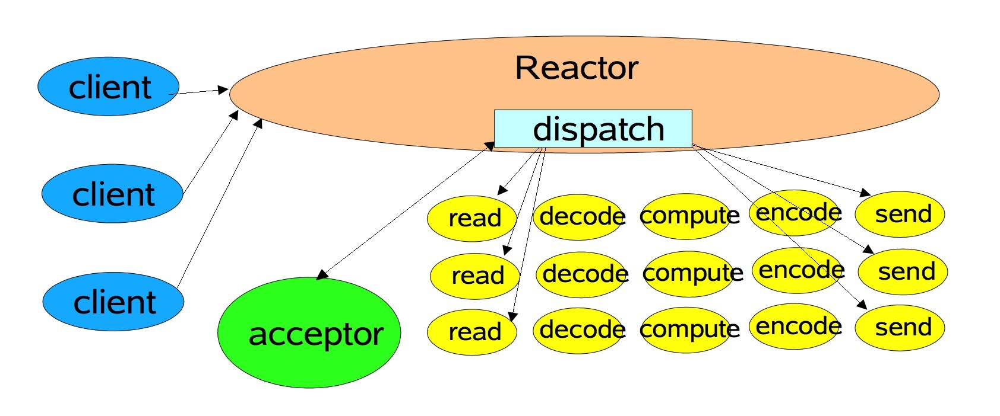
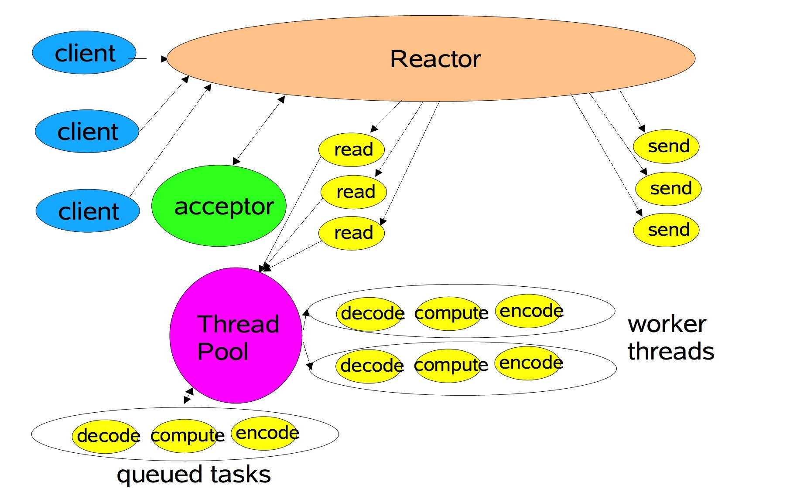
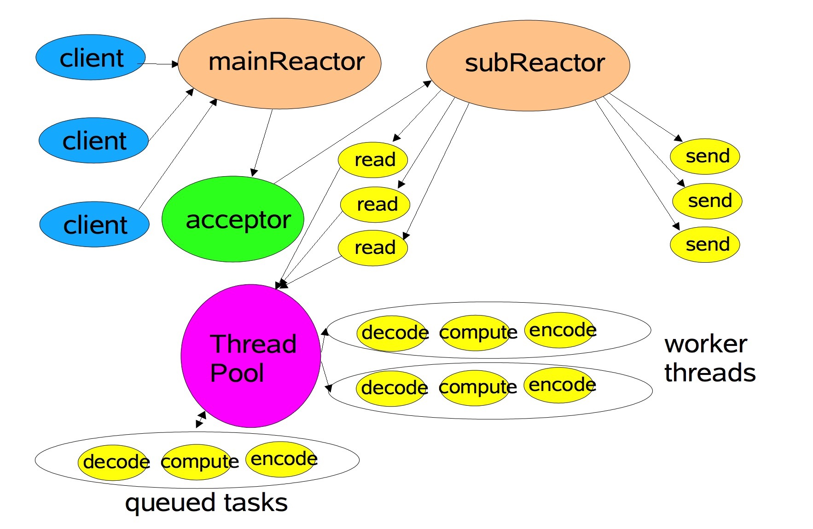

# 基于Netty的WebSocket聊天室Demo
 
这个[项目](https://github.com/spencercjh/leetcode/tree/master/src/javastudy/chat-demo)基于Netty 4.1.x、Spring Boot、Spring WebFlux，构建了一个基于WebSocket协议的多人聊天室Demo。这个项目能够帮助我们快速学习、了解Netty和WebSocket。

## 核心依赖

用途在代码中注明了。
```xml
    <dependencies>
        <!--聊天室界面需要的模板引擎-->
        <dependency>
            <groupId>org.springframework.boot</groupId>
            <artifactId>spring-boot-starter-thymeleaf</artifactId>
        </dependency>
        <!--Web 使用WebFlux而不是MVC-->
        <dependency>
            <groupId>org.springframework.boot</groupId>
            <artifactId>spring-boot-starter-webflux</artifactId>
        </dependency>
        <!--最新的Netty LTS-->
        <dependency>
            <groupId>io.netty</groupId>
            <artifactId>netty-all</artifactId>
            <version>4.1.41.Final</version>
        </dependency>
    </dependencies>
```

## Web部分

既然聊天室是用Netty搭的，为什么Web不用Netty呢？所以就用Spring WebFlux替代了Spring Web MVC。

在这个过程中，碰到了WebFlux无法正确集成Thymeleaf的问题，WebFlux的视图解析`viewResolvers`需要手动地添加。解决如下：[https://blog.csdn.net/fly_leopard/article/details/88355349](https://blog.csdn.net/fly_leopard/article/details/88355349)

负责配置WebFlux的`WebFluxConfig.java`如下。它为WebFlux注册了视图解析器（Thymeleaf的），`@EnableWebFlux`正式开启了WebFlux。
```java
package top.spencercjh.chatdemo.controller;

import org.springframework.beans.factory.annotation.Autowired;
import org.springframework.context.annotation.Configuration;
import org.springframework.web.reactive.config.EnableWebFlux;
import org.springframework.web.reactive.config.ResourceHandlerRegistry;
import org.springframework.web.reactive.config.ViewResolverRegistry;
import org.springframework.web.reactive.config.WebFluxConfigurer;
import org.thymeleaf.spring5.view.reactive.ThymeleafReactiveViewResolver;

/**
 * @author Spencer
 * reference: https://blog.csdn.net/fly_leopard/article/details/88355349
 */
@Configuration
@EnableWebFlux
public class WebFluxConfig implements WebFluxConfigurer {
    /**
     * 引入spring-boot-starter-thymeleaf自动会注入该bean
     */
    @Autowired
    private ThymeleafReactiveViewResolver thymeleafReactiveViewResolver;

    /**
     * 加入thymeleaf试图解析器，不然找不到view name
     * @param registry webflux view registry
     */
    @Override
    public void configureViewResolvers(ViewResolverRegistry registry) {
        registry.viewResolver(thymeleafReactiveViewResolver);
    }

    /**
     * 映射静态资源文件映射
     * @param registry webflux resource registry
     */
    @Override
    public void addResourceHandlers(ResourceHandlerRegistry registry) {
        registry.addResourceHandler("/static/**")
                //指向的是目录
                .addResourceLocations("classpath:/static/");
    }
}
```

负责具体页面的`PageController.java`如下。它非常简单，只是做2个返回HTML视图的Get请求。
```java
package top.spencercjh.chatdemo.controller;

import org.springframework.stereotype.Controller;
import org.springframework.web.bind.annotation.GetMapping;

/**
 * @author Spencer
 */
@Controller
public class PageController {
    @GetMapping("/chat")
    public String chat() {
        return "chat";
    }

    @GetMapping("/index")
    public String index() {
        return "index";
    }
}
```

## Netty部分
Netty的主体框架都在`Netty.java`中。

```java
package top.spencercjh.chatdemo.netty;

import io.netty.bootstrap.ServerBootstrap;
import io.netty.channel.*;
import io.netty.channel.group.ChannelGroup;
import io.netty.channel.group.DefaultChannelGroup;
import io.netty.channel.nio.NioEventLoopGroup;
import io.netty.channel.socket.nio.NioServerSocketChannel;
import io.netty.handler.codec.http.HttpObjectAggregator;
import io.netty.handler.codec.http.HttpServerCodec;
import io.netty.handler.stream.ChunkedWriteHandler;
import io.netty.util.concurrent.GlobalEventExecutor;
import org.springframework.beans.factory.annotation.Value;
import org.springframework.stereotype.Component;

import java.net.InetSocketAddress;

/**
 * @author Spencer
 */
@Component
public class Netty {

    /**
     * 存储所有连接的 channel
     */
    final static ChannelGroup CHANNEL_GROUP = new DefaultChannelGroup(GlobalEventExecutor.INSTANCE);

    public static String WS_HOST;

    public static int WS_PORT;
    private final EventLoopGroup bossGroup = new NioEventLoopGroup();
    private final EventLoopGroup workGroup = new NioEventLoopGroup();
    private Channel channel;

    /**
     * spring boot 不允许/不支持把值注入到静态变量中 所以采用 setter 的方式注入
     */
    @Value("${netty.host}")
    public void setWebSocketHost(String host) {
        WS_HOST = host;
    }

    @Value("${netty.port}")
    public void setWebSocketPort(int port) {
        WS_PORT = port;
    }

    public ChannelFuture start(InetSocketAddress address) {
        ServerBootstrap bootstrap = new ServerBootstrap();
        bootstrap.group(bossGroup, workGroup)
                .channel(NioServerSocketChannel.class)
                .childHandler(new ServerInitializer())
                .option(ChannelOption.SO_BACKLOG, 128)
                .childOption(ChannelOption.SO_KEEPALIVE, true);

        ChannelFuture future = bootstrap.bind(address).syncUninterruptibly();
        channel = future.channel();
        return future;
    }

    public void destroy() {
        if (channel != null) {
            channel.close();
        }
        Netty.CHANNEL_GROUP.close();
        workGroup.shutdownGracefully();
        bossGroup.shutdownGracefully();
    }

    static class ServerInitializer extends ChannelInitializer<Channel> {

        @Override
        protected void initChannel(Channel channel) {
            ChannelPipeline pipeline = channel.pipeline();
            pipeline.addLast("http-codec", new HttpServerCodec());
            pipeline.addLast("aggregator", new HttpObjectAggregator(65536));
            pipeline.addLast("http-chunked", new ChunkedWriteHandler());
            pipeline.addLast("handler", new WebSocketHandler());
        }
    }

}
```

### ServerBootstrap Netty的核心配置

最重要的是启动Netty服务器：
```java
public class Netty {
    //省略其他代码
    
    private final EventLoopGroup bossGroup = new NioEventLoopGroup();
    private final EventLoopGroup workGroup = new NioEventLoopGroup();
    private Channel channel;
    
    public ChannelFuture start(InetSocketAddress address) {
            ServerBootstrap bootstrap = new ServerBootstrap();
            bootstrap.group(bossGroup, workGroup)
                    .channel(NioServerSocketChannel.class)
                    .childHandler(new ServerInitializer())
                    .option(ChannelOption.SO_BACKLOG, 128)
                    .childOption(ChannelOption.SO_KEEPALIVE, true);
    
            ChannelFuture future = bootstrap.bind(address).syncUninterruptibly();
            channel = future.channel();
            return future;
        }
        
    //省略其他代码
}
```

`BossEventLoopGroup`是Main Reactor，其通过事件循环创建TCP连接，然后将连接的`SocketChannel`抽象绑定到`WorkEventLoopGroup`中的`EventLoop`，形成Sub Reactor。


Main Reactor是单线程的事件循环。虽然也可以构造多线程，但是没有意义。因为Netty中在绑定端口时，只会使用`EventLoopGroup`中的一个`EventLoop`绑定到NIO中的`Selector`上，即使是使用了`EventLoopGroup`。


对于同个应用，如果监听多个端口，使用多个`ServerBootstrap`共享一个`BossEventLoopGroup`。这样Main Reactor也是多线程模式了，才有多线程的意义。

 
这里我这样写`bootstrap.group(bossGroup, workGroup)`，就表明使用了2个EventLoopGroup，这是Netty里声明“多Reactor模式”的体现。


`channel(NioServerSocketChannel.class)` Socket连接


`childHandler(new ServerInitializer())` 监听Channel，为channel中的pipeline添加各种handler。
Handler和childHandler的区别如下：https://www.jianshu.com/p/da4d2b5e34ee

#### ServerInitializer
 
ServerInitializer是静态内部类，初始化Channel，为channel的pipeLine添加Handler。其中`HttpServerCodec`是Netty的对HTTP协议的解码handler，`HttpObjectAggregator`是Netty对分块请求的重新聚合Handler，`ChunkedWriteHandler`是Netty分块写返回数据的Handler，`WebSocketHandler`是我们自己实现的对这个应用中WebSocket消息的解析Handler。

```java
public class Netty {
    //省略其他代码
    
    static class ServerInitializer extends ChannelInitializer<Channel> {
    
            @Override
            protected void initChannel(Channel channel) {
                ChannelPipeline pipeline = channel.pipeline();
                pipeline.addLast("http-codec", new HttpServerCodec());
                pipeline.addLast("aggregator", new HttpObjectAggregator(65536));
                pipeline.addLast("http-chunked", new ChunkedWriteHandler());
                pipeline.addLast("handler", new WebSocketHandler());
            }
    }
    
    //省略其他代码
}
```

### WebSocketHandler 业务的具体实现

WebSocketHandler的具体实现如下`WebSocketHandler.java`。

```java
package top.spencercjh.chatdemo.netty;

import com.google.gson.Gson;
import io.netty.buffer.ByteBuf;
import io.netty.buffer.Unpooled;
import io.netty.channel.ChannelFuture;
import io.netty.channel.ChannelFutureListener;
import io.netty.channel.ChannelHandlerContext;
import io.netty.channel.SimpleChannelInboundHandler;
import io.netty.handler.codec.http.DefaultFullHttpResponse;
import io.netty.handler.codec.http.FullHttpRequest;
import io.netty.handler.codec.http.HttpResponseStatus;
import io.netty.handler.codec.http.HttpVersion;
import io.netty.handler.codec.http.websocketx.*;
import io.netty.util.AttributeKey;
import io.netty.util.CharsetUtil;
import lombok.AllArgsConstructor;
import lombok.Data;
import lombok.NoArgsConstructor;
import lombok.experimental.Accessors;
import org.slf4j.Logger;
import org.slf4j.LoggerFactory;
import org.springframework.http.HttpStatus;

import java.util.Date;

/**
 * @author spencercjh
 */
public class WebSocketHandler extends SimpleChannelInboundHandler<Object> {

    private static final Logger logger = LoggerFactory.getLogger(WebSocketHandler.class);
    private final Gson gson = new Gson();
    private WebSocketServerHandshaker handShaker;

    /**
     * 消息读取
     * @param ctx ChannelHandlerContext
     * @param msg WebSocketFrame or HTTP Request
     */
    @Override
    protected void channelRead0(ChannelHandlerContext ctx, Object msg) {
        if (msg instanceof FullHttpRequest) {
            handleHttpRequest(ctx, (FullHttpRequest) msg);
        } else if (msg instanceof WebSocketFrame) {
            handleWebSocketMessage(ctx, (WebSocketFrame) msg);
        }
    }

    /**
     * on open
     * Invoked when a Channel is active; the Channel is connected/bound and ready.
     * 当连接打开时，这里表示有数据将要进站。
     */
    @Override
    public void channelActive(ChannelHandlerContext ctx) {
        Netty.CHANNEL_GROUP.add(ctx.channel());
    }

    /**
     * on close
     * Invoked when a Channel leaves active state and is no longer connected to its remote peer.
     * 当连接要关闭时
     */
    @Override
    public void channelInactive(ChannelHandlerContext ctx) {
        broadcastWsMsg(ctx, new WebSocketMessage(-11000, ctx.channel().id().toString()));
        Netty.CHANNEL_GROUP.remove(ctx.channel());
    }

    /**
     * on msg over
     * Invoked when a read operation on the Channel has completed.
     */
    @Override
    public void channelReadComplete(ChannelHandlerContext ctx) {
        ctx.flush();
    }

    /**
     * onerror
     * 发生异常时
     */
    @Override
    public void exceptionCaught(ChannelHandlerContext ctx, Throwable cause) {
        cause.printStackTrace();
        ctx.close();
    }

    /**
     * 集中处理 ws 中的消息
     */
    private void handleWebSocketMessage(ChannelHandlerContext ctx, WebSocketFrame msg) {
        if (msg instanceof CloseWebSocketFrame) {
            // 关闭指令
            handShaker.close(ctx.channel(), (CloseWebSocketFrame) msg.retain());
        }
        if (msg instanceof PingWebSocketFrame) {
            // ping 消息
            ctx.channel().write(new PongWebSocketFrame(msg.content().retain()));
        } else if (msg instanceof TextWebSocketFrame) {
            TextWebSocketFrame message = (TextWebSocketFrame) msg;
            // 文本消息
            WebSocketMessage webSocketmessage = gson.fromJson(message.text(), WebSocketMessage.class);
            logger.info("接收到消息：" + webSocketmessage);
            switch (webSocketmessage.getType()) {
                // 进入房间
                case 1:
                    // 给进入的房间的用户响应一个欢迎消息，向其他用户广播一个有人进来的消息
                    broadcastWsMsg(ctx, new WebSocketMessage(WebSocketMessage.ENTER_MSG_TYPE, webSocketmessage.getName()));
                    AttributeKey<String> name;
                    if (AttributeKey.exists(webSocketmessage.getName())) {
                        name = AttributeKey.valueOf(webSocketmessage.getName());
                    } else {
                        name = AttributeKey.newInstance(webSocketmessage.getName());
                    }
                    ctx.channel().attr(name);
                    ctx.channel().writeAndFlush(new TextWebSocketFrame(
                            gson.toJson(new WebSocketMessage(WebSocketMessage.WELCOME_MSG_TYPE, webSocketmessage.getName()))));
                    break;
                // 发送消息
                case 2:
                    // 广播消息
                    broadcastWsMsg(ctx, new WebSocketMessage(
                            WebSocketMessage.NORMAL_MSG_TYPE, webSocketmessage.getName(), webSocketmessage.getBody()));
                    break;
                // 离开房间.
                case 3:
                    broadcastWsMsg(ctx, new WebSocketMessage(
                            WebSocketMessage.LEAVE_MSG_TYPE, webSocketmessage.getName(), webSocketmessage.getBody()));
                    break;
                default:
                    break;
            }
            Netty.CHANNEL_GROUP.writeAndFlush(new TextWebSocketFrame(new Date().toString()));
        }
    }

    /**
     * 处理 http 请求，WebSocket 初始握手 (opening handshake ) 都始于一个 HTTP 请求
     */
    private void handleHttpRequest(ChannelHandlerContext ctx, FullHttpRequest fullHttpRequest) {
        if (!fullHttpRequest.decoderResult().isSuccess() || !(WebSocketMessage.HEADER_WEBSOCKET.contentEquals(
                fullHttpRequest.headers().get(WebSocketMessage.HEADER_UPGRADE)))) {
            sendHttpResponse(ctx, new DefaultFullHttpResponse(HttpVersion.HTTP_1_1, HttpResponseStatus.BAD_REQUEST));
            return;
        }
        WebSocketServerHandshakerFactory factory = new WebSocketServerHandshakerFactory(
                "ws://" + Netty.WS_HOST + Netty.WS_PORT, null, false);
        handShaker = factory.newHandshaker(fullHttpRequest);
        if (handShaker == null) {
            WebSocketServerHandshakerFactory.sendUnsupportedVersionResponse(ctx.channel());
        } else {
            handShaker.handshake(ctx.channel(), fullHttpRequest);
        }
    }

    /**
     * 响应非 WebSocket 初始握手请求
     */
    private void sendHttpResponse(ChannelHandlerContext ctx, DefaultFullHttpResponse res) {
        if (HttpStatus.OK.value() != res.status().code()) {
            ByteBuf buf = Unpooled.copiedBuffer(res.status().toString(), CharsetUtil.UTF_8);
            res.content().writeBytes(buf);
            buf.release();
        }
        ChannelFuture channelFuture = ctx.channel().writeAndFlush(res);
        if (HttpStatus.OK.value() != res.status().code()) {
            channelFuture.addListener(ChannelFutureListener.CLOSE);
        }
    }

    /**
     * 广播 websocket 消息（不给自己发）
     */
    private void broadcastWsMsg(ChannelHandlerContext ctx, WebSocketMessage msg) {
        Netty.CHANNEL_GROUP.stream()
                .filter(channel -> !channel.id().equals(ctx.channel().id()))
                .forEach(channel -> channel.writeAndFlush(new TextWebSocketFrame(gson.toJson(msg))));
    }

    @Data
    @AllArgsConstructor
    @NoArgsConstructor
    @Accessors(chain = true)
    static class WebSocketMessage {
        static final String HEADER_UPGRADE = "Upgrade";
        static final String HEADER_WEBSOCKET = "websocket";
        /**
         * 前端：收到进入房间的响应 包含房间信息
         */
        static final int WELCOME_MSG_TYPE = -1;
        /**
         * 前端：收到其他人发过来的消息
         */
        static final int NORMAL_MSG_TYPE = -2;
        /**
         * 前端：收到其他人离开房间的信息
         */
        static final int LEAVE_MSG_TYPE = -11000;
        /**
         * 前端：收到其他人进入房间的消息
         */
        static final int ENTER_MSG_TYPE = -10001;
        /**
         * 消息类型
         */
        private int type;
        /**
         * 用户名称
         */
        private String name;
        /**
         * 房间 ID
         */
        private long roomId;
        /**
         * 消息主体
         */
        private String body;
        /**
         * 错误码
         */
        private int errorCode;

        WebSocketMessage(int type, String name) {
            this.type = type;
            this.name = name;
            this.errorCode = 0;
        }

        WebSocketMessage(int type, String name, String body) {
            this.type = type;
            this.name = name;
            this.body = body;
            this.errorCode = 0;
        }
    }
}
```

#### channelRead0方法

读取消息全在这里`channelRead0`方法中实现。Please keep in mind that this method will be renamed to messageReceived(ChannelHandlerContext, I) in 5.0. 结果我去github Netty Repo上看发现5代早着呢，现在用的是`4.1.41`。

扯远了。在这里需要判断消息是FullHttpRequest还是WebSocket消息。WebSocket的初始握手是一个HTTP请求。

```java
public class WebSocketHandler extends SimpleChannelInboundHandler<Object> {
    // 省略其他代码
    @Override
    protected void channelRead0(ChannelHandlerContext ctx, Object msg) {
        if (msg instanceof FullHttpRequest) {
            handleHttpRequest(ctx, (FullHttpRequest) msg);
        } else if (msg instanceof WebSocketFrame) {
            handleWebSocketMessage(ctx, (WebSocketFrame) msg);
        }
    }
    //省略其他代码
}
```

#### handleWebSocketMessage方法

我们离聊天室的核心代码越来越近了，进入`handleWebSocketMessage(ctx, (WebSocketFrame) msg)`方法。这里已经有很多注释了，就索性话全部在代码里说吧。

后面还要学一下AttributeMap：https://blog.csdn.net/zxhoo/article/details/17719333

```java
public class WebSocketHandler extends SimpleChannelInboundHandler<Object> {
    // 省略其他代码
    private void handleWebSocketMessage(ChannelHandlerContext ctx, WebSocketFrame msg) {
        if (msg instanceof CloseWebSocketFrame) {
            // 关闭指令
            handShaker.close(ctx.channel(), (CloseWebSocketFrame) msg.retain());
        }
        if (msg instanceof PingWebSocketFrame) {
            // ping 消息
            ctx.channel().write(new PongWebSocketFrame(msg.content().retain()));
        } else if (msg instanceof TextWebSocketFrame) {
            TextWebSocketFrame message = (TextWebSocketFrame) msg;
            // 文本消息
            WebSocketMessage webSocketmessage = gson.fromJson(message.text(), WebSocketMessage.class);
            logger.info("接收到消息：" + webSocketmessage);
            switch (webSocketmessage.getType()) {
                // 进入房间
                case 1:
                    // 前端：msg.name + " 进入了聊天室" 这条消息是广播的
                    broadcastWsMsg(ctx, new WebSocketMessage(WebSocketMessage.ENTER_MSG_TYPE, webSocketmessage.getName()));
                    ctx.channel().writeAndFlush(new TextWebSocketFrame(
                            // 前端："欢迎 " + username + " 进入聊天室" 这条消息是给自己发的
                            gson.toJson(new WebSocketMessage(WebSocketMessage.WELCOME_MSG_TYPE, webSocketmessage.getName()))));
                    break;
                // 发送消息
                case 2:
                    // 广播消息
                    broadcastWsMsg(ctx, new WebSocketMessage(
                            WebSocketMessage.NORMAL_MSG_TYPE, webSocketmessage.getName(), webSocketmessage.getBody()));
                    break;
                // 离开房间.
                case 3:
                    broadcastWsMsg(ctx, new WebSocketMessage(
                            WebSocketMessage.LEAVE_MSG_TYPE, webSocketmessage.getName(), webSocketmessage.getBody()));
                    break;
                default:
                    break;
            }
            Netty.CHANNEL_GROUP.writeAndFlush(new TextWebSocketFrame(new Date().toString()));
        }
    }
    
    private void broadcastWsMsg(ChannelHandlerContext ctx, WebSocketMessage msg) {
        Netty.CHANNEL_GROUP.stream()
        // 有些同学可能不熟悉函数式编程和Stream API
        // JDK的Doc应该能帮到你：Returns a stream consisting of the elements of this stream that match the given predicate。
        // 简单说就是传一个函数f进去，返回一个Stream，里面包含所有满足函数f条件的元素
        // 这里函数f判断stream里的id等不等于现在ChannelHandlerContext的id
                .filter(channel -> !channel.id().equals(ctx.channel().id()))
                // foreach就是传一个函数f进去，每一个元素都要作为f的参数，执行一些操作。
                // 这里每个channel都会写一个WebSocket帧
                .forEach(channel -> channel.writeAndFlush(new TextWebSocketFrame(gson.toJson(msg))));
    }
    //省略其他代码
}
```

#### handleHttpRequest方法

说完了WebSocket消息的接收和发送，来看看如何建立WebSocket连接，即如何处理HTTP请求。同样在代码里直接写解析。

```java
public class WebSocketHandler extends SimpleChannelInboundHandler<Object> {
    // 省略其他代码
    private void handleHttpRequest(ChannelHandlerContext ctx, FullHttpRequest fullHttpRequest) {
        // HTTP解码结果不正确 或者 不包含正确的WebSocket握手的头部信息，返回CODE=400的HTTP Response
        if (!fullHttpRequest.decoderResult().isSuccess() || !(WebSocketMessage.HEADER_WEBSOCKET.contentEquals(
                fullHttpRequest.headers().get(WebSocketMessage.HEADER_UPGRADE)))) {
            sendHttpResponse(ctx, new DefaultFullHttpResponse(HttpVersion.HTTP_1_1, HttpResponseStatus.BAD_REQUEST));
            return;
        }
        // 没仔细研究，这是一个建立WebSocket连接的工厂，两行代码，连接就建起来了。
        WebSocketServerHandshakerFactory factory = new WebSocketServerHandshakerFactory(
                "ws://" + Netty.WS_HOST + Netty.WS_PORT, null, false);
        handShaker = factory.newHandshaker(fullHttpRequest);
        // 没仔细研究，这里可能是因为浏览器的问题导致WebSocket的版本不被支持，不支持也能发。我粗略看了一下，返回一个HTTP的Response
        if (handShaker == null) {
            WebSocketServerHandshakerFactory.sendUnsupportedVersionResponse(ctx.channel());
        } else {
            handShaker.handshake(ctx.channel(), fullHttpRequest);
        }
    }
    //省略其他代码
}
```

## Netty线程模型 

看到这里，对IO模型，线程模型不熟悉的朋友肯定已经迷糊了，这里简要介绍一下：

以下架构图中，read,decode,compute,encode,send 是一个完整的请求处理流程。

### 单线程Reactor模式

   

一个线程又要处理TCP连接（acceptor），又要响应请求：编解码、处理业务逻辑

### 多线程Reactor模式



Reactor线程仍然是单线程，负责acceptor和IO read/send。但是对于请求的解码以及业务处理和响应的编码都是有work thread pool负责。

### 多Reactor模式



其中主Reactor响应用户的连接事件，然后分发给acceptor，由其创建新的子Reactor。多个子Reactor分别处理各自的IO事件，比如read/write，然后再将其交给work thread pool进行解码，业务处理，编码。

多Reactor的设计通过将TCP连接建立和IO read/write事件分离至不同的Reactor，从而分担单个Reactor的压力，提升其响应能力。

## 源码

https://github.com/spencercjh/leetcode/tree/master/src/javastudy/chat-demo

## 参考资料

聊天室Demo：https://blog.csdn.net/xiaoping0915/article/details/81202851

Netty线程模型：https://www.cnblogs.com/lxyit/p/10430939.html

NIO Model: http://gee.cs.oswego.edu/dl/cpjslides/nio.pdf